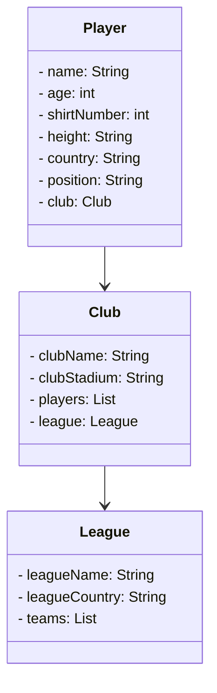

# Santander Dev Week 2024
Java RESTful API criada para a Santander Dev Week.

A API foi desenvolvida para fornecer um serviço de gerenciamento de jogadores, clubes e ligas. Ela é baseada em tecnologias modernas e segue as melhores práticas de desenvolvimento.

## Principais Tecnologias
 - **Java 17**: A versão LTS mais recente do Java para tirar vantagem das últimas inovações que essa linguagem robusta e amplamente utilizada oferece;
 - **Spring Boot 3**: A mais nova versão do Spring Boot, que maximiza a produtividade do desenvolvedor por meio de sua poderosa premissa de autoconfiguração;
 - **Spring Data JPA**: Foi explorado como essa ferramenta pode simplificar nossa camada de acesso aos dados, facilitando a integração com bancos de dados SQL;
 - **OpenAPI (Swagger)**: Foi criado uma documentação de API eficaz e fácil de entender usando a OpenAPI (Swagger), perfeitamente alinhada com a alta produtividade que o Spring Boot oferece;

## Exemplos de Uso

Aqui estão alguns exemplos simples de como usar a API:

#### Recuperar um jogador por ID
```http
GET /player/{id}
```


#### Criar um novo jogador
```http
POST /player
Content-Type: application/json

{
  "name": "Nome do Jogador",
  "age": 23,
  "shirtNumber": 10,
  "height": "175",
  "country": "Brasil",
  "position": "Left Winger"
}
```
Não é necessário, ao criar um jogador, passar o Clube, o ideal é primeiro cadastrar um jogador e um clube respectivamente, e em seguida, atribuir um Clube ao jogador.

## Diagrama de Classes



## Diagrama de Casos de Uso


